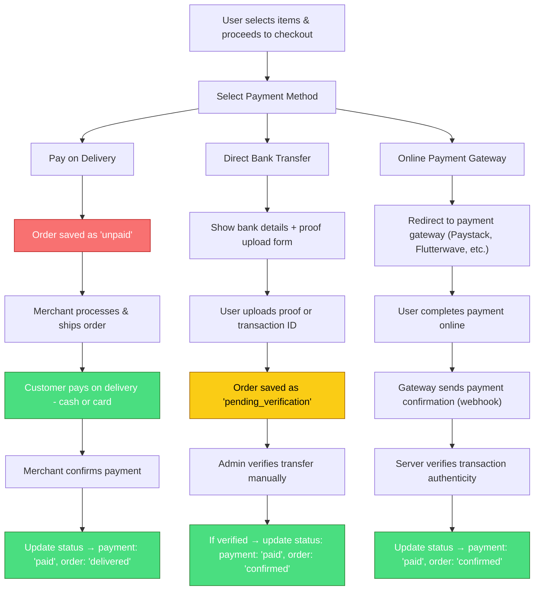

```mermaid
flowchart TD

%% Checkout
A["User selects items & proceeds to checkout"] --> B["Select Payment Method"]

%% Payment Options
B --> C1["Pay on Delivery"]
B --> C2["Direct Bank Transfer"]
B --> C3["Online Payment Gateway"]

%% Pay on Delivery flow
C1 --> D1["Order saved as 'unpaid'"]
D1 --> E1["Merchant processes & ships order"]
E1 --> F1["Customer pays on delivery - cash or card"]
F1 --> G1["Merchant confirms payment"]
G1 --> H1["Update status → payment: 'paid', order: 'delivered'"]

%% Bank Transfer flow
C2 --> D2["Show bank details + proof upload form"]
D2 --> E2["User uploads proof or transaction ID"]
E2 --> F2["Order saved as 'pending_verification'"]
F2 --> G2["Admin verifies transfer manually"]
G2 --> H2["If verified → update status: payment: 'paid', order: 'confirmed'"]

%% Online Gateway flow
C3 --> D3["Redirect to payment gateway (Paystack, Flutterwave, etc.)"]
D3 --> E3["User completes payment online"]
E3 --> F3["Gateway sends payment confirmation (webhook)"]
F3 --> G3["Server verifies transaction authenticity"]
G3 --> H3["Update status → payment: 'paid', order: 'confirmed'"]

%% Styling
classDef paid fill:#4ade80,stroke:#2e7d32,color:#fff
classDef pending fill:#facc15,stroke:#a16207,color:#000
classDef unpaid fill:#f87171,stroke:#b91c1c,color:#fff

class D1 unpaid
class F1 paid
class F2 pending
class H1,H2,H3 paid
```
